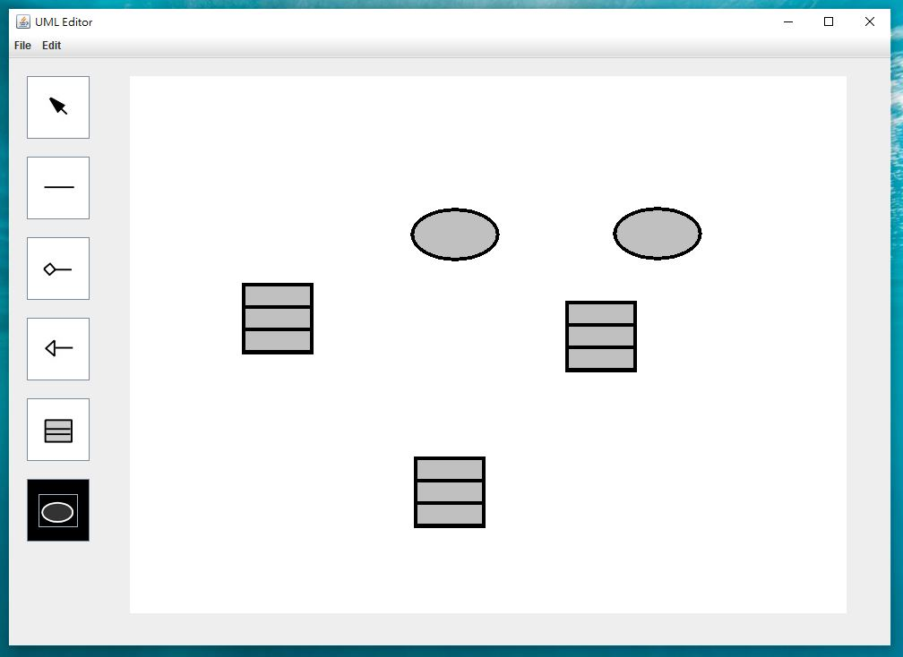

This is the final project in NCU's OOP course which aims to build a UML editor by JAVA.

When you run it(I use Eclipse), you can see as foloow:

Then you can create somethings on it.

Finally, add some relationship!

